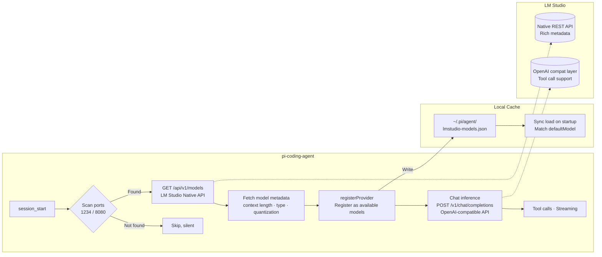

# pi-lmstudio-provider

> Auto-discover your LM Studio local models for [pi-coding-agent](https://github.com/nicholasgasior/pi-mono). Zero config, just works. 🚀

**中文文档：** [README.md](README.md)

## ✨ Highlights

This plugin does one thing well: **finds models loaded in LM Studio and registers them with pi — automatically.**

- 🔍 **Auto-detect** — Scans for LM Studio when pi starts, registers available models. No configuration needed.
- 🧠 **Rich metadata** — Uses LM Studio's native REST API to get real context length, model type, and quantization info.
- 🛠️ **You control the params** — temperature, top_p, and friends? Tune them in LM Studio. The plugin won't override your settings.
- 📌 **Remembers your model** — Caches model list so you don't need to re-select after restarting pi.
- 🔐 **Auth support** — Connect your LM Studio API Token via `/login` command or environment variable.

> Want to tweak model parameters? Head to LM Studio's preset panel. pi will use whatever you've set.

## 🏗️ Architecture

Two APIs, each doing what it's best at:



**Why not use just one API?** LM Studio's native chat API (`/api/v1/chat`) doesn't support custom tool calls — and pi as a coding agent can't function without them. So:

| Purpose | API | Why |
|---------|-----|-----|
| Model discovery | `/api/v1/models` (native) | Richer metadata — real context length, quantization info |
| Chat inference | `/v1/chat/completions` (OpenAI compat) | Full tool call support, plugs right into pi's built-in provider |

## 📦 Installation

```bash
pi install git:github.com/LambdaXIII/pi-lmstudio-provider
```

## 🔧 Prerequisites

1. Install [LM Studio](https://lmstudio.ai/) (v0.4.0+)
2. Start the local server in LM Studio's **Developer** tab
3. Load at least one LLM or VLM model

That's it. Launch pi and you're good to go — no extra config.

## 💬 Commands

| Command | Description |
|---------|-------------|
| `/lmstudio` | Detect LM Studio, register models, show status |
| `/lmstudio off` | Temporarily disable (current session only, auto-restores on next restart) |
| `/login lmstudio` | Enter your LM Studio API Token (when auth is enabled) |

## ⚙️ Custom Port

If LM Studio is running on a non-default port, set the environment variable:

```bash
# Single port
LMSTUDIO_PORT=9999 pi

# Multiple ports (comma-separated, scanned in order)
LMSTUDIO_PORT=1234,8080,9999 pi
```

## 🔐 API Token Authentication

LM Studio doesn't require authentication by default — most users don't need to configure anything.

If you've enabled authentication (**Developer → Server Settings → Require Authentication**), there are two ways to provide your token:

### Option 1: /login command (recommended)

Inside pi, simply type:

```
/login lmstudio
```

Pi will prompt you for the token. It's saved to `~/.pi/agent/auth.json` — you only need to enter it once.

### Option 2: Environment variable

```bash
LM_API_TOKEN=your-token pi
```

Priority: environment variable > stored credentials. `LM_API_KEY` also works (backward compat).

## License

[MIT](LICENSE)
