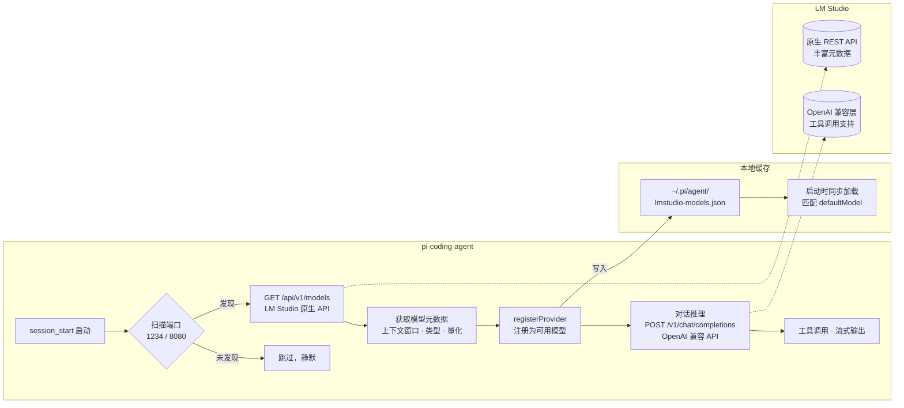

# pi-lmstudio-provider

> 让 [pi-coding-agent](https://github.com/nicholasgasior/pi-mono) 自动发现你的 LM Studio 本地模型，零配置开箱即用 🚀

**English version:** [README.en.md](README.en.md)

## ✨ 特色

这个插件做的事情很简单：**自动发现 LM Studio 里加载的模型，注册给 pi 用。**

- 🔍 **自动检测** — 启动 pi 时自动扫描 LM Studio，发现可用模型直接注册，不需要你配置任何东西
- 🧠 **完整元数据** — 用 LM Studio 原生 REST API 拿到真实的上下文窗口、模型类型、量化信息
- 🛠️ **参数你去调** — temperature、top_p 这些参数？去 LM Studio 里调，插件不会覆盖你的设置
- 📌 **记住你的模型** — 自动缓存模型列表，重启 pi 后不需要重新选择模型
- 🔐 **认证支持** — 通过 `/login` 命令或环境变量接入 LM Studio API Token

> 想调模型参数？去 LM Studio 的预设面板里调就好，pi 会直接用你设的值。

## 🏗️ 架构

两套 API，各取所长：



**为什么不用一套 API？** LM Studio 的原生聊天 API（`/api/v1/chat`）不支持自定义工具调用，而 pi 作为 coding agent 离不开工具。所以：

| 用途 | API | 理由 |
|------|-----|------|
| 模型发现 | `/api/v1/models`（原生） | 元数据更丰富，能拿到真实的上下文窗口和量化信息 |
| 聊天推理 | `/v1/chat/completions`（OpenAI 兼容） | 完美支持工具调用，pi 内置实现即插即用 |

## 📦 安装

```bash
pi install git:github.com/LambdaXIII/pi-lmstudio-provider
```

## 🔧 前置要求

1. 安装 [LM Studio](https://lmstudio.ai/)（v0.4.0+）
2. 在 LM Studio 的 **Developer** 选项卡中启动本地服务器
3. 加载至少一个 LLM 或 VLM 模型

就这三步，然后正常启动 pi 就行了，不需要额外配置。

## 💬 命令

| 命令 | 说明 |
|------|------|
| `/lmstudio` | 检测 LM Studio、注册模型、显示状态 |
| `/lmstudio off` | 临时关闭（仅本次会话，下次启动自动恢复） |
| `/login lmstudio` | 输入 LM Studio API Token（开启认证时使用） |

## ⚙️ 自定义端口

如果你的 LM Studio 用了非默认端口，设置环境变量就行：

```bash
# 单端口
$env:LMSTUDIO_PORT = "9999"; pi

# 多端口（逗号分隔，按顺序扫描）
$env:LMSTUDIO_PORT = "1234,8080,9999"; pi
```

## 🔐 API Token 认证

LM Studio 默认不要求认证，大部分情况下你不需要做任何设置。

如果开启了认证（**Developer → Server Settings → Require Authentication**），有两种方式传入 Token：

### 方式一：/login 命令（推荐）

在 pi 里直接输入：

```
/login lmstudio
```

pi 会弹出输入框让你粘贴 Token。输入后 Token 会保存在 `~/.pi/agent/auth.json`，以后不再需要重复输入。

### 方式二：环境变量

```bash
$env:LM_API_TOKEN = "你的token"; pi
```

优先级：环境变量 > 已存储的凭证。`LM_API_KEY` 也能用（向后兼容）。

## License

[MIT](LICENSE)
